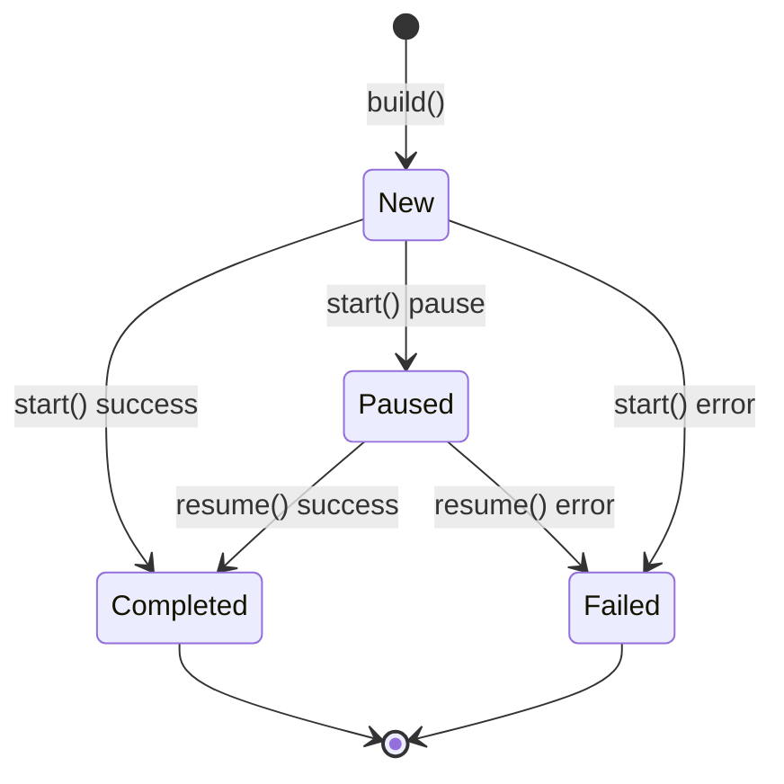
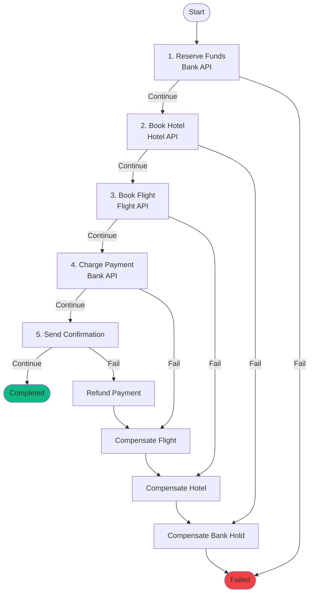

# Legend

A strict, composable saga VM for sequential workflows with compensation.

Legend is a dependency-light orchestration runtime that runs **sequential workflows** with **compensation** (a.k.a. the *Saga* pattern). It focuses on **compile-time safety, composability, and resumability**.

## Features

- **Compile-time validation**: Empty programs and invalid state transitions are compile errors
- **Composable blocks**: Reusable step sequences that can be nested via the `block!` macro
- **Typestate execution**: `New` → `Paused`/`Completed`/`Failed` enforced by the type system
- **Strict compensation**: No silent failures - compensation must explicitly succeed or fail
- **Async-first**: Built with `async_trait` for native async/await support
- **Serializable state**: Pause, persist, and resume workflows across process restarts
- **Step timing**: Track execution duration for each step with `StepTiming`
- **Storage abstraction**: `Store` trait for persisting paused executions with `InMemoryStore` included
- **Tracing support**: Optional tracing events for each step (enable `tracing` feature)

## Quick Start: Travel Booking Saga

A complete flight + hotel booking system with automatic rollback on failure.

```rust
use legend::{Step, StepOutcome, CompensationOutcome, RetryPolicy, ExecutionResult, legend};

// =============================================================================
// Context & Errors
// =============================================================================

#[derive(Default, Clone, Debug, serde::Serialize, serde::Deserialize)]
struct TravelContext {
    // Bank API responses
    hold_id: Option<String>,
    charge_id: Option<String>,

    // Hotel API responses
    hotel_reservation_id: Option<String>,

    // Flight API responses
    flight_reservation_id: Option<String>,

    // Final confirmation
    confirmation_code: Option<String>,
}

#[derive(thiserror::Error, Clone, Debug, serde::Serialize, serde::Deserialize)]
enum TravelError {
    #[error("Bank API: Insufficient funds")]
    InsufficientFunds,
    #[error("Bank API: Hold expired")]
    HoldExpired,
    #[error("Hotel API: No rooms available")]
    HotelUnavailable,
    #[error("Flight API: No seats available")]
    FlightUnavailable,
    #[error("Service temporarily unavailable")]
    ServiceUnavailable,
}

// =============================================================================
// Step 1: Reserve Funds (Bank API)
// =============================================================================

struct ReserveFunds;

#[async_trait::async_trait]
impl Step<TravelContext, TravelError> for ReserveFunds {
    type Input = u64; // amount in cents

    async fn execute(ctx: &mut TravelContext, amount: &u64) -> Result<StepOutcome, TravelError> {
        // POST /api/bank/holds { amount, customer_id }
        // Returns: { hold_id: "hold_abc123", expires_at: "..." }
        let hold_id = format!("hold_{}", amount);
        ctx.hold_id = Some(hold_id);
        Ok(StepOutcome::Continue)
    }

    async fn compensate(ctx: &mut TravelContext, _: &u64) -> Result<CompensationOutcome, TravelError> {
        // DELETE /api/bank/holds/{hold_id}
        ctx.hold_id = None;
        Ok(CompensationOutcome::Completed)
    }

    fn retry_policy() -> RetryPolicy {
        RetryPolicy::retries(3) // Bank API can be flaky
    }
}

// =============================================================================
// Step 2: Book Hotel (Hotel API)
// =============================================================================

struct BookHotel;

#[async_trait::async_trait]
impl Step<TravelContext, TravelError> for BookHotel {
    type Input = (String, String, u32); // (hotel_id, room_type, nights)

    async fn execute(ctx: &mut TravelContext, input: &Self::Input) -> Result<StepOutcome, TravelError> {
        let (hotel_id, room_type, nights) = input;
        // POST /api/hotels/{hotel_id}/reservations
        // Body: { room_type, nights, check_in, check_out }
        // Returns: { reservation_id: "htl_xyz789" }
        let reservation_id = format!("htl_{}_{}", hotel_id, nights);
        ctx.hotel_reservation_id = Some(reservation_id);
        Ok(StepOutcome::Continue)
    }

    async fn compensate(ctx: &mut TravelContext, _: &Self::Input) -> Result<CompensationOutcome, TravelError> {
        // DELETE /api/hotels/reservations/{reservation_id}
        ctx.hotel_reservation_id = None;
        Ok(CompensationOutcome::Completed)
    }
}

// =============================================================================
// Step 3: Book Flight (Flight API)
// =============================================================================

struct BookFlight;

#[async_trait::async_trait]
impl Step<TravelContext, TravelError> for BookFlight {
    type Input = (String, String, String); // (flight_number, departure, seat_class)

    async fn execute(ctx: &mut TravelContext, input: &Self::Input) -> Result<StepOutcome, TravelError> {
        let (flight_number, departure, seat_class) = input;
        // POST /api/flights/{flight_number}/bookings
        // Body: { departure_date, seat_class, passenger_info }
        // Returns: { booking_id: "flt_abc456" }
        let booking_id = format!("flt_{}_{}", flight_number, departure);
        ctx.flight_reservation_id = Some(booking_id);
        Ok(StepOutcome::Continue)
    }

    async fn compensate(ctx: &mut TravelContext, _: &Self::Input) -> Result<CompensationOutcome, TravelError> {
        // DELETE /api/flights/bookings/{booking_id}
        ctx.flight_reservation_id = None;
        Ok(CompensationOutcome::Completed)
    }

    fn retry_policy() -> RetryPolicy {
        RetryPolicy::retries(2)
    }
}

// =============================================================================
// Step 4: Charge Payment (Bank API)
// =============================================================================

struct ChargePayment;

#[async_trait::async_trait]
impl Step<TravelContext, TravelError> for ChargePayment {
    type Input = ();

    async fn execute(ctx: &mut TravelContext, _: &()) -> Result<StepOutcome, TravelError> {
        // POST /api/bank/charges
        // Body: { hold_id: ctx.hold_id }
        // Converts the hold into an actual charge
        let Some(hold_id) = &ctx.hold_id else {
            return Err(TravelError::HoldExpired);
        };
        ctx.charge_id = Some(format!("chg_{}", hold_id));
        Ok(StepOutcome::Continue)
    }

    async fn compensate(ctx: &mut TravelContext, _: &()) -> Result<CompensationOutcome, TravelError> {
        // POST /api/bank/refunds { charge_id }
        ctx.charge_id = None;
        Ok(CompensationOutcome::Completed)
    }
}

// =============================================================================
// Step 5: Send Confirmation
// =============================================================================

struct SendConfirmation;

#[async_trait::async_trait]
impl Step<TravelContext, TravelError> for SendConfirmation {
    type Input = String; // customer email

    async fn execute(ctx: &mut TravelContext, _email: &String) -> Result<StepOutcome, TravelError> {
        // Generate confirmation code from all booking IDs
        let code = format!(
            "TRIP-{}-{}",
            ctx.hotel_reservation_id.as_ref().map(|s| &s[..7]).unwrap_or(""),
            ctx.flight_reservation_id.as_ref().map(|s| &s[..7]).unwrap_or("")
        );
        ctx.confirmation_code = Some(code);
        // POST /api/notifications/email { to, subject, body }
        Ok(StepOutcome::Continue)
    }

    async fn compensate(ctx: &mut TravelContext, _: &String) -> Result<CompensationOutcome, TravelError> {
        // POST /api/notifications/email { to, subject: "Cancellation Notice" }
        ctx.confirmation_code = None;
        Ok(CompensationOutcome::Completed)
    }
}

// =============================================================================
// Define the Travel Booking Saga
// =============================================================================

legend! {
    TravelBooking<TravelContext, TravelError> {
        reserve_funds: ReserveFunds,
        book_hotel: BookHotel,
        book_flight: BookFlight,
        charge_payment: ChargePayment,
        send_confirmation: SendConfirmation,
    }
}

// =============================================================================
// Run the Saga
// =============================================================================

let saga = TravelBooking::new(TravelBookingInputs {
    reserve_funds: 89900,                                           // $899.00
    book_hotel: ("marriott_nyc".into(), "king".into(), 3),         // 3 nights
    book_flight: ("UA123".into(), "2024-06-15".into(), "economy".into()),
    charge_payment: (),
    send_confirmation: "traveler@example.com".into(),
});

let execution = saga.build(TravelContext::default());

match execution.start().await {
    ExecutionResult::Completed(exec) => {
        println!("Trip booked! Confirmation: {:?}", exec.context().confirmation_code);
    }
    ExecutionResult::Paused(exec) => {
        // Serialize for later (e.g., waiting for external approval)
        let json = serde_json::to_string(&exec)?;
        save_to_db(&json).await?;
    }
    ExecutionResult::Failed(_, err) => {
        // All previous steps were automatically rolled back:
        // - Flight cancelled (if booked)
        // - Hotel cancelled (if booked)
        // - Bank hold released
        println!("Booking failed: {:?}", err);
    }
    ExecutionResult::CompensationFailed { original_error, .. } => {
        // Requires manual intervention - some rollback failed
        alert_ops_team(original_error).await;
    }
}
```

### What Happens on Failure?

If the flight booking fails (Step 3), Legend automatically compensates in reverse order:

1. ~~Book Flight~~ → **Failed** (no seats available)
2. **Compensate Hotel** → DELETE /api/hotels/reservations/{id}
3. **Compensate Bank** → DELETE /api/bank/holds/{id}

The customer is never charged, and no orphaned reservations remain.

### Resume After Pause

```rust
// Resume a paused execution (e.g., after manager approval for large bookings)
async fn resume_booking(booking_id: &str) -> Result<(), Error> {
    let json = load_from_db(booking_id).await?;
    let execution: Execution<_, _, _, Paused> = serde_json::from_str(&json)?;

    match execution.resume().await {
        ExecutionResult::Completed(exec) => {
            println!("Trip booked! {}", exec.context().confirmation_code.as_ref().unwrap());
        }
        ExecutionResult::Failed(_, err) => {
            println!("Booking failed: {:?}", err);
        }
        _ => {}
    }
    Ok(())
}
```

## Execution Flow

### State Diagram



### Compensation Flowchart



## Core Concepts

### Step

A unit of work implementing the `Step<Ctx, Err>` trait:

```rust
#[async_trait::async_trait]
impl Step<MyContext, MyError> for MyStep {
    type Input = MyInput;

    async fn execute(ctx: &mut MyContext, input: &MyInput) -> Result<StepOutcome, MyError> {
        // Perform the forward action
        Ok(StepOutcome::Continue)
    }

    async fn compensate(ctx: &mut MyContext, input: &MyInput) -> Result<CompensationOutcome, MyError> {
        // Undo the action during rollback
        Ok(CompensationOutcome::Completed)
    }

    fn retry_policy() -> RetryPolicy {
        RetryPolicy::NoRetry // or RetryPolicy::retries(3)
    }
}
```

### StepOutcome

Controls execution flow from `execute` (returned via `Result<StepOutcome, E>`):

- `Continue` - Proceed to the next step
- `Pause` - Suspend execution (can be serialized and resumed later)

Errors are returned via `Err(e)`, which triggers retry (if policy allows) or compensation.

### CompensationOutcome

Controls compensation flow (returned via `Result<CompensationOutcome, E>`):

- `Completed` - Compensation succeeded
- `Pause` - Compensation needs to pause

Errors are returned via `Err(e)`, representing critical failures requiring manual intervention.

### RetryPolicy

Configures automatic retries for transient failures:

```rust
// No retries (default)
RetryPolicy::NoRetry

// Retry up to 3 times
RetryPolicy::retries(3)

// Retry with backoff hint (100ms)
RetryPolicy::retries_with_backoff(3, 100)
```

### ExecutionResult

The outcome of `start()` or `resume()`:

```rust
match execution.start().await {
    ExecutionResult::Completed(exec) => {
        // Success - access final context
        let ctx = exec.into_context();
    }
    ExecutionResult::Paused(exec) => {
        // Suspended - serialize for later
        let json = serde_json::to_string(&exec)?;
    }
    ExecutionResult::Failed(exec, error) => {
        // Failed after compensation
        println!("Error: {:?}", error);
    }
    ExecutionResult::CompensationFailed { original_error, compensation_error, .. } => {
        // Compensation also failed - critical state
    }
}
```

### Composable Blocks

Define reusable step sequences with the `block!` macro:

```rust
use legend::block;

block! {
    PaymentBlock<PaymentContext, PaymentError> {
        reserve: ReserveFunds,
        charge: ChargePayment,
    }
}

// Blocks implement Step, so they can be nested in programs
legend! {
    OrderSaga<OrderContext, OrderError> {
        validate: ValidateOrder,
        payment: PaymentBlock,  // Nested block!
        ship: ShipOrder,
    }
}
```

## Storage

Legend provides a `Store` trait for persisting paused executions, enabling workflows to survive process restarts:

```rust
use legend::{Store, InMemoryStore, ExecutionId, Execution, Paused};

// Create a store (in-memory for development, implement Store for production)
let store = InMemoryStore::new();

// When execution pauses, save it
if let ExecutionResult::Paused(exec) = execution.start().await {
    let id = ExecutionId::new();
    let data = serde_json::to_vec(&exec)?;
    store.save(id, data).await?;
    println!("Saved paused execution: {}", id);
}

// Later: retrieve and resume
let record = store.get(id).await?;
let exec: Execution<_, _, _, Paused> = serde_json::from_slice(&record.data)?;
let result = exec.resume().await;

// Clean up after completion
store.delete(id).await?;
```

### Store Trait

Implement the `Store` trait for custom backends (Redis, PostgreSQL, sled, etc.):

```rust
use legend::{Store, StoreError, PausedRecord, ExecutionId};

#[async_trait::async_trait]
impl Store for MyStore {
    /// Save a paused execution.
    async fn save(&self, id: ExecutionId, data: Vec<u8>) -> Result<(), StoreError>;

    /// Get a paused execution by ID.
    async fn get(&self, id: ExecutionId) -> Result<PausedRecord, StoreError>;

    /// Delete a paused execution (after resuming).
    async fn delete(&self, id: ExecutionId) -> Result<(), StoreError>;

    /// Check if an execution exists.
    async fn exists(&self, id: ExecutionId) -> Result<bool, StoreError>;
}
```

The `InMemoryStore` implementation uses `parking_lot::RwLock` for thread-safe access and is suitable for testing and single-process deployments.

## Step Timing

Legend tracks timing for each step execution:

```rust
use legend::{StepTiming, StepOutcome};

// After execution completes, access timing data
let timings = execution.state().step_timings();

for timing in timings {
    println!(
        "Step {} ({}): {:?} in {:?}ms",
        timing.step_index,
        if timing.is_compensation { "compensate" } else { "execute" },
        timing.outcome,
        timing.duration_ms()
    );
}
```

`StepOutcome` values:
- `Continue` - Step proceeded to next
- `Pause` - Step paused execution
- `Failed` - Step failed
- `Compensated` - Step was compensated
- `CompensationFailed` - Compensation failed

## Tracing

Enable the `tracing` feature for step-level tracing events:

```toml
[dependencies]
legend = { version = "0.1", features = ["tracing"] }
```

Events emitted:
- `step.start` - Step execution begins
- `step.end` - Step execution ends (with outcome)
- `step.retry` - Step is being retried
- `compensate.start` - Compensation begins
- `compensate.end` - Compensation ends (with outcome)

## Type Safety

Legend uses Rust's type system to prevent errors at compile time:

### Empty Programs

```rust
// This won't compile - HSingle requires at least one step
legend! {
    Empty<Ctx, Err> {
        // No steps - compile error!
    }
}
```

### Invalid State Transitions

```rust
let exec = saga.build(ctx);

// Won't compile - New state has no `resume` method
exec.resume().await;

if let ExecutionResult::Completed(done) = exec.start().await {
    // Won't compile - Completed state has no `start` or `resume`
    done.start().await;
}
```

## Testing

Steps are async functions, making them easy to unit test:

```rust
#[tokio::test]
async fn test_reserve_funds() {
    let mut ctx = PaymentContext::default();
    let result = ReserveFunds::execute(&mut ctx, &1000).await;
    assert!(result.is_continue());
    assert!(ctx.reservation_id.is_some());
}
```

See `src/tests/` for comprehensive examples:
- `basic.rs` - Success path tests
- `compensation.rs` - Rollback tests
- `retry.rs` - Retry policy tests
- `pause.rs` - Pause/resume tests

## Why Sagas?

Distributed operations often cross multiple resources (databases, payment systems, external APIs). Two-phase commit is heavy and often unavailable. Sagas keep each step **locally atomic** and rely on **compensation** to restore invariants on failure.

Use Legend for:
- Payment flows
- Account provisioning
- Document pipelines
- Any multi-step process with meaningful rollback semantics

## Design Goals

- **Compile-time safety**: Invalid programs don't compile
- **Strict compensation**: No silent failures
- **Composability**: Reusable blocks that nest via `block!` macro
- **Testability**: Each step is an async function over your context type
- **Resumability**: Serialize execution state, pause, persist, and resume later

## Notes on Reliability

- Prefer **idempotent** steps; retrying becomes safe
- Compensation must be **explicit** - return `Completed` or `Critical`
- Record enough data in the context for audit trails and troubleshooting

## License

MIT
